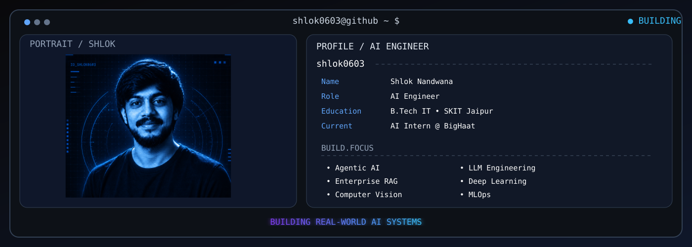

<p align="center">
  
</p>


<p align="center">
<a href="https://github.com/shlok0603">

</a>

<a href="https://github.com/shlok0603?tab=followers">

</a>

<a href="https://github.com/shlok0603">

</a>

<a href="https://github.com/shlok0603">

</a>

</p>

<p align="center">


</p>

---

# 🏅 Experience
<div align="center">

| 💼 Role | 🏢 Organization | 📅 Duration |
|---------|-----------------|------------|
| 🚜 AI Intern | **BigHaat India** | Present |
| 🤖 Ex-AI Developer Intern | **Jabit Soft Pvt. Ltd.** | Feb 2026 – Jul 2026 |
| 🎓 Winter ML Trainee | **IIT Kanpur (EICT Academy)** | Winter 2025 |
| 📊 Ex-Machine Learning Intern | **Dzaro Solutions** | Jun 2025 – Jul 2025 |

</div>

---

# Tech Stack

## Programming Languages

<p align="left">

</p>

---

## Artificial Intelligence & Machine Learning

<p align="left">


</p>

---

## Agentic AI & LLMs

<p align="left">


</p>

---

## Backend Development

<p align="left">

</p>

---

## Databases & Vector Databases

<p align="left">


</p>

---

## Tools & Technologies

<p align="left">


</p>

---

# GitHub Analytics

<p align="center">
  
</p>

---

# Contribution Graph

<p align="center">

</p>

---
# GitHub Metrics

<p align="center">


</p>

<p align="center">


</p>

<p align="center">


</p>

---
# Current Focus

```text
Learning        : Agentic AI • Multi-Agent Systems • MLOps

Working On      : Enterprise AI Applications

Ask Me About    : Python • Machine Learning • Deep Learning
                     Generative AI • RAG • LangChain
                     FastAPI • LLMs • Computer Vision

Goal 2026       : AI Engineer Internship @ Top Product Company

Fun Fact        : I enjoy solving complex DSA problems
                     and building AI that solves real-world challenges.
```

---
# 🚀 Featured Projects

<div align="center">

<table>

<tr>

<td width="50%">

## 🩺 Diabetic Retinopathy Detection

<p align="center">

</p>

### 🔬 AI-powered Medical Image Classification

Early detection and grading of **Diabetic Retinopathy** using advanced Deep Learning and Computer Vision techniques.

### ✨ Features

✅ EfficientNetB2 & Swin Transformer

✅ ResNet50 Benchmark

✅ Image Augmentation Pipeline

✅ Automated Disease Grading

✅ High Accuracy Prediction

### ⚙️ Tech Stack

<p align="center">


</p>

<p align="center">


</p>

<p align="center">

<a href="https://github.com/shlok0603/diabetic-retinopathy-detection">


</a>

</p>

</td>

<td width="50%">

## 📚 Enterprise Multi-Modal RAG Platform

<p align="center">

</p>

### 🤖 Enterprise AI Knowledge Assistant

Production-ready Retrieval-Augmented Generation platform for intelligent document search and conversational AI.

### ✨ Features

✅ Multi-modal PDF Ingestion

✅ LangChain + LlamaIndex

✅ CLIP Embeddings

✅ FAISS / ChromaDB

✅ Semantic Search

✅ LLM-powered Question Answering

### ⚙️ Tech Stack

<p align="center">


</p>

<p align="center">


</p>

<p align="center">

<a href="https://github.com/shlok0603/Enterprise_Multimodal_RAG">


</a>

</p>

</td>

</tr>

</table>

</div>

---

# 🌍 Connect With Me

<p align="center">

<a href="https://www.linkedin.com/in/shlok-nandwana-74b7a127b/">

</a>


<a href="https://github.com/shlok0603">

</a>

<a href="mailto:shlok.nandwana@gmail.com">

</a>

</p>

---


## 🐍 Contribution Snake

<p align="center">
  
</p>

---

## 💬 Quote of the Day

<p align="center">


</p>
<p align="center">


</p>
